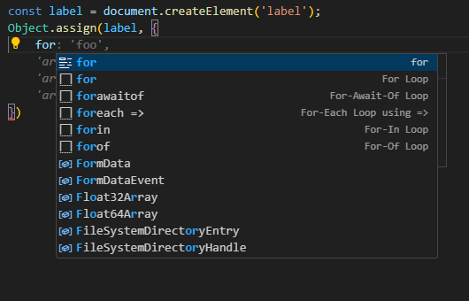
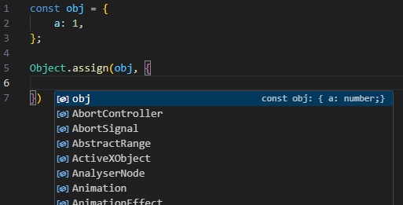
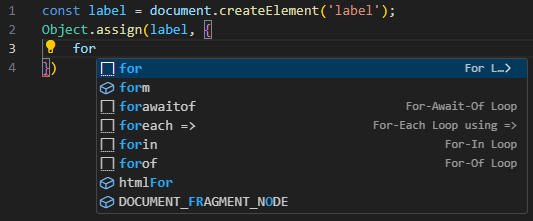
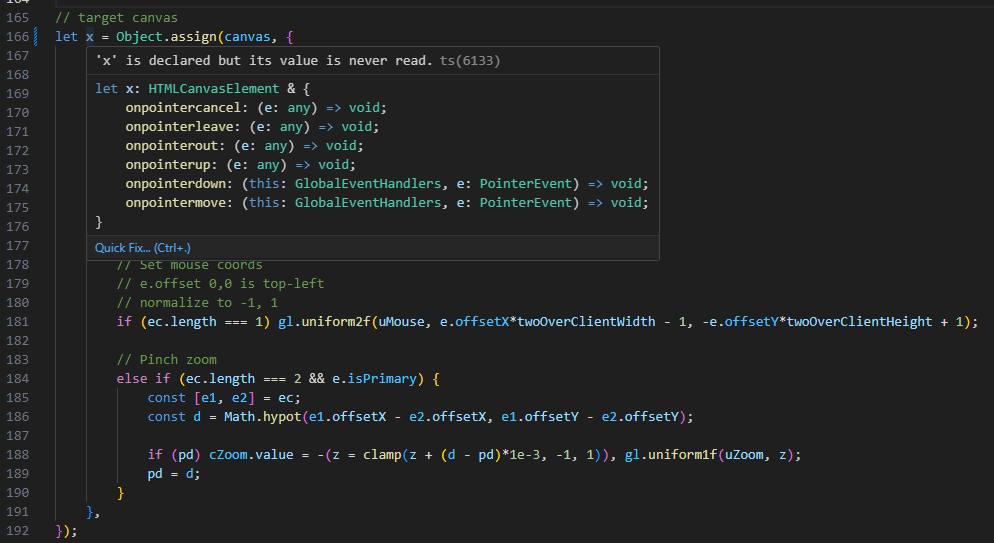
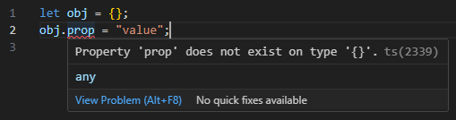
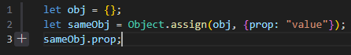
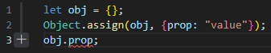
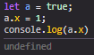
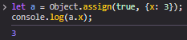

# ES6 Object.assign()

- [Problem](#problem)
- [Easy Solution](#the-easy-solution)
- [Powerful Solution](#a-powerful-solution)
- [Going Deeper](#going-deeper)

## Problem

The following is a *dense*, but **powerful** observation of a really neat tool. It all started with this:



uhh what's it called again? Where are the properties of this object?



**wtf?**... When using a method called "**Object.assign**", and expecting it to "assign multiple properties to an object", **why can't I see the existing properties of the object I'm assigning to???**

## The easy solution

The definition under TypeScript/src/lib/es2015.core.d.ts:

```ts
assign<T extends {}, U>(target: T, source: U): T & U;
```

Should be:

```ts
assign<T extends {}, U>(target: T, source: U & {[K in keyof T]: T[K]}): T & U;
```

This *basically* says, "source can be itself, including *keys* of the target". And if we plug that in...

 

**Boom.**

## Not that simple

Sure, this works, but its not always accurate... yet. You just opened a can of worms in TypeScript, "implementations of JavaScript", and [ECMA-262](img/https://262.ecma-international.org/6.0/#sec-object.assign). Let's talk about some big implications of this:

- We can see the props of the target object we're assigning multiple props to (as useful as it sounds).
- If we use it in a **declaration**, we can see the static structure of the returned object, even in JS with VSCode.



Look at those code snippets again. *That's JS baby!*

This also helps in TypeScript, with its convenient non-null assertion `!`. In TS, we can avoid explicit casting when mutating an object, because `Object.assign` returns the correct type. Thus, instead of:



We can do this:



With the **kink** being, `Object.assign` must be part of a declaration for it to be statically evaluated. The following is valid, but not in TypeScript:



## A powerful solution

Here's the [best solution](/es2015.core.d.ts) I've found. Take your time here.

```ts
 assign<T extends {}, U extends {}>(target: T,
    source: (U extends (boolean | string | number)? never: U | {[K in keyof T]: T[K]})
): T & (U extends object? {[K in keyof U]: U[K]}: never);
```

`Object.assign` always returns the target, so ignore `T` for now.  

```ts
...U extends {}
```

From what I'm reading, `U extends object` would filter out the primitives but in my tests it returns `... & object`. We can do better with manual filtering:

```ts
(U extends (boolean | string | number)? never: U /* This is more accurate, assigning an object without properties like primitives would result in nothing being assigned. */
```

Improved return signature to filter out functions and primitives:

```ts
): T & (U extends object? {[K in keyof U]: U[K]}: never) /* if U has props, return an intersection of those props. Also prevents intersections of source functions with the target. Only the target can be callable, and it can't be re-assigned with Object.assign(). */
```

Extending to more sources:

```ts
assign<T extends {}, U extends {}, V extends {}>(target: T,
    source1: (U extends (boolean | string | number)? never: U | {[K in keyof T]: T[K]}),
    source2: (V extends (boolean | string | number)? never: V | {[K in keyof T]: T[K]}),
): T & (U extends object? {[K in keyof U]: U[K]}: never) & 
(V extends object? {[K in keyof V]: V[K]}: never);
```

Some details are best left to the [test suite](/objectAssignPrimitives.ts), but to sum it up:

- We made `Object.assign` more useful in ways its most likely to be used.
- By improving the type signature, it behaves much closer to reality. It prevents a couple issues like:
    1. Attempting to call an anonymous function assigned to an object.

    ```ts
    const F = Object.assign({}, funcA)
    F("s") // Expect fatal error: 'not callable'
    ```

    2. Attempting to assign "primitives" to an object.

    ```ts
    const A = Object.assign(obj1, true); // nothing is assigned!
    ```

- Improving the type signature has a side effect of making the types more accurate. Most of these are weird edge cases, but this is part of what makes `Object.assign()` different from `return {...obj1, ...obj2}`.

    1. Assigning properties from a function to an object copies the expected properties from a function.

    ```ts
    function a(){}; // Yes, this is valid.
    a.prop = "value"; // No, you shouldn't do this.
    const b = Object.assign({}, a); // b = {prop: "value"}
    ```

    2. "Primitive objects", unique to Object.assign.

    ```ts
    let a = Object.assign(3, {prop: "val"});
    // (a == 3) -> true
    // (a === 3) -> false
    ```

## Going Deeper

Below, you will see some truly awful code.

### So you're not really supposed to do this...



But it turns out you can.



And the structure you get out of this is ridiculous.


This happens to work for other primitives.

```ts
const a = Object.assign(3.3, {prop: "aprop"});
const b = Object.assign(4.4, {prop: "bprop"});

console.log(`a < b: ${a < b}`); // a < b: true
console.log((a < b)? a.prop : b.prop); // "aprop"
```

I guess if you really want to compare objects as primitive values... you psycho. Its safer now but still unexplored.

Finally, I leave you with a "work of art". We first define a function that iterates and executes its own values, then we assign some functions as values and execute it after assignment. If that makes no sense, read it again, its very abstract.

```ts
const runQueue = () => {
    Object.values(runQueue).forEach((v) => {v()})
}
const task1 = () => {
    console.log(...Object.keys(runQueue))
    /* 0 1 2 */
}
const task2 = () => {
    console.log(...Object.entries(runQueue))
    /* ['0', ƒ] ['1', ƒ] ['2', ƒ] */
}
const task3 = () => {
    console.log(...Object.values(runQueue))
    // Converts functions to string
    /* () => {
    console.log(...Object.keys(runQueue));
    } () => {
        console.log(...Object.entries(runQueue));
    } () => {
        console.log(...Object.values(runQueue));
    } */
}
Object.assign(runQueue, [task1, task2, task3])() // Execute the function returned by Object.assign()()
```

**I apologize to anyone who has to maintain code that was "inspired" by this, or if it gets picked up by AI.**

## Links

- [ECMA-262](https://262.ecma-international.org/6.0/#sec-object.assign)
- [Test Suite](/objectAssignPrimitives.ts)
- [Revised es2015.core.d.ts](/es2015.core.d.ts)
- [Performance of properties on functions](https://gist.github.com/lord-xld3/2521a868e48d9a79270ef972054ed12b)