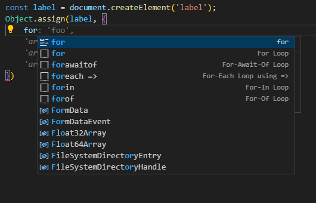
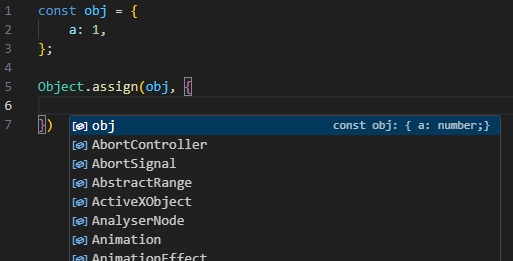
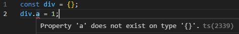
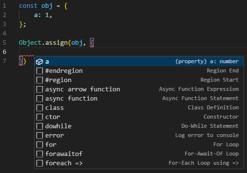
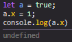
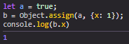
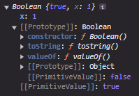

# ES6 Object.assign()

The following is a *dense*, but **powerful** observation of a really neat tool. It all started with this:



uhh what's it called again? Where are the properties of this object?



## **wtf?!!**  

When we all start crossing the border between "JavaScript", and TypeScript, we come to this:



...when it works just fine in JavaScript...and I expect you have seen and understand this...

**Static-ly, `div.a` doesn't exist until it is evaluated.**

And the answer to this is usually "ugly, explicit type-casting", or **Object.assign**

## The easy solution

**The definition under TypeScript/src/lib/es2015.core.d.ts**

```ts
assign<T extends {}, U>(target: T, source: U): T & U;
```

Should be:

```ts
assign<T extends {}, U>(target: T, source: U & {[K in keyof T]: T[K]}): T & U;
```

This *basically* says, "source can be itself, including *keys* of the target". And if we plug that in...

 

**Boom.**

## Not that simple

Sure, this works, but its not always accurate... yet. You just opened a can of worms in TypeScript, "implementations of JavaScript", and [ECMA-262](https://262.ecma-international.org/6.0/#sec-object.assign). Let's talk about some big implications of this:

- We can see the props of the target object we're assigning multiple props to (as useful as it sounds).
- 

Look at those code snippets again. *That's JS baby!*

## A powerful solution

No more teasing, here's the best I've got:

```ts
 assign<T extends {}, U extends {}>(
        target: T,
        source: (U extends (boolean | string | number)? never: U | {[K in keyof T]: T[K]}),
    ): T & (U extends object? {[K in keyof U]: U[K]}: never)
```

Take your time here, this one goes deep. Here we go:

`Object.assign` always returns the target, so ignore its type. 

```ts
...U extends {}
```

From what I'm reading, `U extends object` would filter out the primitives but in my tests it returns `... & object`. We can do better with manual filtering:

```ts
(U extends (boolean | string | number)? never: U /* This is more accurate, assigning an object without properties like primitives would result in nothing being assigned. */
```


```ts
): T & (U extends object? {[K in keyof U]: U[K]}: never) /* if U has props, return an intersection of those props. Also prevents intersections of source functions with the target. Only the target can be callable, and it can't be re-assigned with Object.assign(). */
```

Extending to more sources:

```ts
assign<T extends {}, U extends {}, V extends {}>(
        target: T,
        source1: (U extends (boolean | string | number)? never: U | {[K in keyof T]: T[K]}),
        source2: (V extends (boolean | string | number)? never: V | {[K in keyof T]: T[K]}),
    ): T & (U extends object? {[K in keyof U]: U[K]}: never) & 
    (V extends object? {[K in keyof V]: V[K]}: never)
```

Some details are best left to the [test suite](objectAssignPrimitives.ts), but to sum it up:

- Prevents a few incorrect ways to use .assign
- Allows for some grotesque, but type-safe primitive BS

## Going Deeper

Below, you will see some truly awful code.

### So you're not really supposed to do this...



But it turns out you can.



And the structure you get out of this is ridiculous.



This happens to work for other primitives.

```ts
const a = Object.assign(3.3, {prop: "aprop"});
const b = Object.assign(4.4, {prop: "bprop"});

console.log(`a < b: ${a < b}`); // a < b: true
console.log((a < b)? a.prop : b.prop); // "aprop"
```

I guess if you really want to compare objects as primitive values... you psycho. Its safer now but still unexplored.

Functions can have properties, so I came up with this insane example. We first define a function that iterates and executes its own values, then we assign some functions as values and execute it after assignment.

```ts
const runQueue = () => {
    Object.values(runQueue).forEach((v) => {v()})
}
const task1 = () => {
    console.log(...Object.keys(runQueue))
    /* 0 1 2 */
}
const task2 = () => {
    console.log(...Object.entries(runQueue))
    /* ['0', ƒ] ['1', ƒ] ['2', ƒ] */
}
const task3 = () => {
    console.log(...Object.values(runQueue))
    // Converts functions to string
    /* () => {
    console.log(...Object.keys(runQueue));
    } () => {
        console.log(...Object.entries(runQueue));
    } () => {
        console.log(...Object.values(runQueue));
    } */
}
Object.assign(runQueue, [task1, task2, task3])() // Execute the function returned by Object.assign()()
```

... and the worst problem is property access times on functions. [Avoid using props on functions.](https://gist.github.com/lord-xld3/2521a868e48d9a79270ef972054ed12b)

There's more we can show like `Object.assign` correctly copying properties to/from functions including mixed object sources, but again **you should not assign props to a function.**

## Links

- [ECMA-262](https://262.ecma-international.org/6.0/#sec-object.assign)
- [Test Suite](/objectAssignPrimitives.ts)
- [Revised es2015.core.d.ts](/es2015.core.d.ts)
- [Avoid using props on functions](https://gist.github.com/lord-xld3/2521a868e48d9a79270ef972054ed12b)